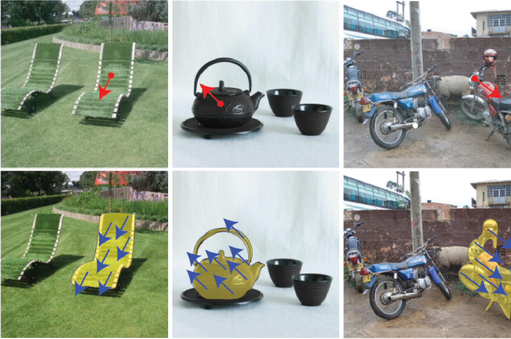

<div align="center">
<h2>Discovering and using Spelke segments </h2>

[**Rahul Venkatesh***](https://rahulvenkk.github.io/)<sup>1</sup> · [**Klemen Kotar***](https://klemenkotar.github.io/)<sup>1</sup> · [**Lilian Naing Chen***](https://www.linkedin.com/in/lilian-chen-1975b81b1)<sup>1</sup> · [**Simon Kim**](https://www.linkedin.com/in/seungwoo-simon-kim)<sup>1</sup>· [**Luca Thomas Wheeler**]()<sup>1</sup> · [**Jared Watrous**](https://www.linkedin.com/in/jared-watrous)<sup>1</sup> · [**Ashley Xu**](https://www.linkedin.com/in/ashley-xu-a2588b1a9)<sup>1</sup> · [**Gia Ancone**](https://www.linkedin.com/in/gia-ancone-58b545207)<sup>1</sup> ·  [**Wanhee Lee**](https://scholar.google.com/citations?user=BdHgmrUAAAAJ&hl=ko)<sup>1</sup> [**Honglin Chen**](https://x.com/honglin_c?lang=en)<sup>2</sup> ·[**Daniel Bear**](https://twitter.com/recursus?lang=en)<sup>3</sup> ·  [**Stefan Stojanov**](https://sstojanov.github.io/)<sup>1</sup> ·  [**Daniel L. K. Yamins**](https://stanford.edu/~yamins/)<sup>1</sup>

<sup>1</sup>Stanford&emsp;&emsp;&emsp;&emsp;<sup>2</sup>OpenAI&emsp;&emsp;&emsp;&emsp;<sup>3</sup>Noetik, Inc.

(* equal contribution)

<a href="https://www.arxiv.org/pdf/2507.16038"></a>
<a href='https://neuroailab.github.io/spelke_net/'></a>
</div>

<!-- Insert teaser image here -->

[//]: # (![Teaser Figure]&#40;demo_images/teaser.png&#41;)

<p align="center">
  
</p>

---

## 📦 SpelkeBench: A benchmark for evaluating Spelke segment extraction

**SpelkeBench** is a dataset of 500 images with associated segmentation annotations for evaluating models' ability to extract **Spelke segments**. Unlike conventional definitions of segmentation, Spelke segments provide a category-agnostic notion of segments based on what moves together in the physical world.

### 🔽 Download Instructions

To download the dataset, run the following command from the top level of the repository, which will save the dataset inside the `datasets/` folder:

```bash
sh scripts/download_spelke_bench.sh
```


### 📁 Dataset Format

The dataset is a `.h5` file where each key contains a dictionary with the following entries:

- `image`: The input image  
- `segments_gt`: The ground truth Spelke segments  
- `poke_location`: The location of the virtual poke to be used by the model to generate the segments

### 🖼️ Example Outputs

Some examples from the dataset are shown below and comparisons to SAM and Entity segmentation are illustrated below.

<p align="center">
  
</p>

[//]: # (---)

[//]: # ()
[//]: # (### 🛠️ Evaluation Utilities )

[//]: # ()
[//]: # (We also provide some code to explore the dataset and utilities for evaluation here:  )

[//]: # (🔗 [https://github.com/neuroailab/SpelkeBench.git]&#40;https://github.com/neuroailab/SpelkeBench.git&#41;)


---

## 🕸️ SpelkeNet: Operationalizing Spelke segments

To discover Spelke segments, we build **SpelkeNet**, a model that learns to complete flow fields and implicitly captures how objects move together in the physical world. 

### Setting up the Conda environment to use SpelkeNet ###

```bash
cd SpelkeNet
conda create -n spelkenet python=3.10 -y
conda activate spelkenet
pip install -e .
```

### Two key structure extractions from SpelkeNet for object discovery ### 

- **Motion Affordance Maps**: which estimate the regions likely to respond to an external force, independent of camera motion.

<p align="center">
  
</p>

- **Expected Displacement Maps**: A flow field that captures how the scene will respond to an applied virtual poke.

<p align="center">
  
</p>


We provide jupyter notebooks which demonstrate how these maps can be extracted from SpelkeNet:
- 📓 [Motion Affordance Maps](notebooks/Motion_Affordance.ipynb)
- 📓 [Expected Displacement Maps](notebooks/Expected_Displacement.ipynb)


### 🔍 Statistical counterfactual probing for Spelke object discovery ###

Using these structure extractions, we first sample a location that is likely to move from the motion affordance map, and apply various virtual pokes at this location in order to identify regions that consistently move together. We then compute the expected motion correlation by averaging across various pokes the dot product between the poke vector and the expected displacement map. Finally, Otsu thresholding on the averaged dot product yields our desired Spelke segment.


<p align="center">
  
</p>

We provide a notebook which demonstrates how to extract Spelke segments from SpelkeNet:
- 📓 [Spelke Object Discovery](notebooks/Spelke_Object_Discovery.ipynb)

## 📊 Evaluating SpelkeNet on SpelkeBench

We provide scripts to run inference and evaluate segmentation models on the **SpelkeBench** dataset. To evaluate a model define a model class that inherits from:

```python
spelke_net.inference.spelke_object_discovery.spelke_bench_class.SpelkeBenchModel
```

and implement the `run_inference` method with the following signature:

```python 
class SpelkeBenchModel:
    """
    Base class for SpelkeBench models.
    This class should be inherited by all models that are used in the SpelkeBench framework.
    """

    def __init__(self):
        """args to initialize the model"""
        return

    def run_inference(self, input_image, poke_point):
        '''
        Run inference on the input image and poke point.
        :param input_image: numpy array of shape [H, W, 3] in [0, 1] range
        :param poke_point: (x, y) tuple representing the poke point in the image, x horizontal, y vertical
        :return: H, W numpy array representing the segment mask
        '''
```

We provide a reference implementation of a SpelkeNet model in [`spelke_net.inference.spelke_object_discovery.spelke_bench_class.SpelkeNetModel1B`](https://github.com/neuroailab/SpelkeNet/blob/main/spelke_net/inference/spelke_object_discovery/spelke_bench_class.py#L312). This class is initialized with the following default values:

| Parameter         | Default Value | Description                                                                                                                              |
|-------------------|---------------|------------------------------------------------------------------------------------------------------------------------------------------|
| `num_zoom_iters`  | `2`           | Number of zoom-in refinement iterations.                                                                                                 |
| `num_seq_patches` | `256`         | Number of sequential flow token generations                                                                                              |
| `num_seeds`       | `3`           | Number of rollouts per virtual poke                                                                                                      |
| `num_dirs`        | `8`           | Number of virtual pokes                                                                                                                  |
| `model_name`      | `model_1B.pt` | Name of the model checkpoint file to load. Refers to the 1-billion parameter SpelkeNet checkpoint. |
| `num_zoom_dirs`   | `5`           | Number of virtual pokes to be applied during the zooming in stage                                                                        |

### 🖼️ Inference on a single image or a small set

Use the following command to run inference on one or more images:

```bash
python spelke_net/inference/spelke_object_discovery/run_inference.py \
  --device cuda:<device_id> \
  --dataset_path ./datasets/spelke_bench.h5 \
  --img_names entityseg_1_image2926 \
  --output_dir <out_dir>
  --model_name SpelkeNetModel1B
```


| Flag             | Description                                                                 |
|------------------|-----------------------------------------------------------------------------|
| `--device`       | Which GPU to use (e.g., `cuda:0`)                                           |
| `--dataset_path` | Path to the SpelkeBench `.h5` file                                          |
| `--img_names`    | Space-separated list of image keys in the `.h5` file                        |
| `--output_dir`   | Directory to save prediction outputs                                        |

You can pass multiple image keys like:

```bash
--img_names entityseg_1_image2926 entityseg_2_image1258 ...
```


### ⚙️ Parallel Inference on a Multi-Node Cluster

To run inference **in parallel across multiple nodes and GPUs**, we provide a wrapper script. Here's a typical setup assuming:

- 4 nodes are available  
- each node has 4 GPUs  
- you want to split the workload evenly across nodes  

You would launch the following **on each node** with node-specific values:

```bash
python spelke_net/inference/spelke_object_discovery/run_inference_parallel.py \
  --gpus 0 1 2 3 \
  --dataset_path ./datasets/spelke_bench.h5 \
  --output_dir <out_dir> \
  --num_splits 4 \
  --split_num <node_id> \
  --model_name SpelkeNetModel1B
```

To use the larger **7B model**, replace the model name:```--model_name SpelkeNetModel7B```

### 💾 Output Format

Each prediction is saved as a separate `.h5` file in `<out_dir>`, containing the following keys:

- `segment_pred`: predicted Spelke segment mask  
- `segment_gt`: ground truth Spelke segment mask  
- `probe_point`: virtual poke location  
- `image`: original input image  


### 📊 Evaluation

After inference is complete, run the evaluation script:

```bash
python spelke_net/inference/spelke_object_discovery/evaluate_folder.py \
  --input_dir <out_dir> \
  --output_dir <metrics_out_dir>
```

This will:
- Save visualizations to `<metrics_out_dir>`
- Print the following metrics to the console:
  - Average Recall (AR)
  - Mean Intersection-over-Union (mIOU)

| Metric | SAM2   | DINOv1-B/8 | DINOv2-L/14| DINOv2-G/14 | CWM | SpelkeNet |
|--------|--------|--------|--------|--------|------|--------|
| AR     | 0.4816 | 0.2708 | 0.2524 | 0.2254 | 0.3271 | **0.5411** |
| mIoU   | 0.6225 | 0.4990 | 0.4931 | 0.4553 | 0.4807 | **0.6811** |


### 🧠 Testing Your Own Model

To evaluate a custom model:
1. Implement a model class following the `SpelkeNetModel` interface in the file `spelke_net/inference/spelke_object_discovery/spelke_bench_class.py`.
2. Pass its class name to the `--model_name` argument in the above commands.

---

## 🔧 Using Spelke segments for object manupulation

### Evaluating models on 3DEditBench

#### Step 1: Install the `3DEditBench` package

```
git clone https://github.com/neuroailab/3DEditBench.git`
cd 3DEditBench
conda activate spelkenet
pip install -e . --no-deps
```
#### Step 2: Download `3DEditBench` into `datasets/3DEditBench/`  by running:

```bash
cd SpelkeNet
sh scripts/download_3DEditBench.sh
```

#### Step 2: Download precomputed segments using SpelkeNet and SAM on 3DEditBench

This command will download the precomputed segments into `datasets/precomputed_segments/`

```bash
sh scripts/download_3DEditBench_precomputed_segments.sh
```

#### Step 3: Parallel Inference on a multi-node cluster

To run inference in parallel across multiple nodes and GPUs, 3DEditBench provides a wrapper script similar to SpelkeBench evaluation.

For a cluster of 4 Nodes × 4 GPUs, on each node, launch:

```bash
editbench-launch \
  --gpus 0 1 2 3 \
  --dataset_path ./datasets/3DEditBench \
  --output_dir ./experiments/my_model_run \
  --num_splits 4 \
  --split_num <node_id> \
  --model_class <your_model.YourEditingModel>
```

Replace `<node_id>` with the appropriate node index (`0`, `1`, `2`, or `3`).

#### Available Models for Evaluation


You can choose from the following predefined models by setting the `--model_class` flag:

| Model Class                                                                                                                                                                               | Description                                                                                              |
|-------------------------------------------------------------------------------------------------------------------------------------------------------------------------------------------|----------------------------------------------------------------------------------------------------------|
| [`spelke_net.inference.object_manipulation.edit_model.ObjectEditModelSAM`](https://github.com/neuroailab/SpelkeNet/blob/main/spelke_net/inference/object_manipulation/edit_model.py#L387) | Uses the Segment Anything Model (SAM) to generate object masks (pre-computed) based on the point prompt. |
| [`spelke_net.inference.object_manipulation.edit_model.ObjectEditModelSpelkeNet`](https://github.com/neuroailab/SpelkeNet/blob/main/spelke_net/inference/object_manipulation/edit_model.py#L396)                                                                                                        | Uses SpelkeNet to infer motion-based object segments (pre-computed) from point prompts.                                |
| [`spelke_net.inference.object_manipulation.edit_model.ObjectEditModelGT`](https://github.com/neuroailab/SpelkeNet/blob/main/spelke_net/inference/object_manipulation/edit_model.py#L379)  | Uses the ground-truth segmentation masks provided in the 3DEditBench dataset.                            |

> 📌 Tip: After all splits finish, you can evaluate the results with the `editbench-evaluate-metrics` utilty on the `hdf5_result_files/` directory.

---

#### Step 4: Evaluate Aggregate Metrics

After all splits finish, you can evaluate your model’s aggregating performance on `3DEditBench`:
```bash
editbench-evaluate-metrics \
  --predictions_path ./experiments/my_model_run/hdf5_result_files
  --results_dir <your_results_dir>
```

#### 📊 Benchmark Results

| Method              | Segment    | MSE ↓   | PSNR ↑ | LPIPS ↓ | SSIM ↑ | EA ↑   |
|---------------------|------------|---------|--------|---------|--------|--------|
| [LRAS-3D](https://neuroailab.github.io/projects/lras_3d/) | **SpelkeNet** | **0.009** | **21.64** | **0.213** | **0.698** | **0.776** |
|                     | SAM        | 0.013   | 20.17  | 0.255   | 0.685  | 0.633  |
| [LightningDrag](https://lightning-drag.github.io/)        | **SpelkeNet** | **0.017** | **19.16** | **0.195** | **0.672** | **0.679** |
|                     | SAM        | 0.020   | 18.18  | 0.241   | 0.658  | 0.536  |
| [Diffusion Handles](https://diffusionhandles.github.io/)  | **SpelkeNet** | **0.024** | **17.42** | **0.364** | **0.555** | **0.576** |
|                     | SAM        | 0.031   | 16.15  | 0.419   | 0.526  | 0.495  |
| [Diffusion as Shader](https://igl-hkust.github.io/das/)   | **SpelkeNet** | **0.015** | **19.29** | **0.194** | **0.707** | **0.640** |
|                     | SAM        | 0.019   | 18.20  | 0.253   | 0.682  | 0.503  |

### Applying your own object manipulations

Use the command below to apply custom object edits with either SAM or SpelkeNet segments by setting the `segment_type` flag. You can control the object’s rotation (azimuth, elevation, tilt) and translation (tx, ty, tz) in 3‑D space. These transformations are specified in the world coordinate system, where azimuth controls rotation around the axis vertical to the ground plane. 

```bash
CUDA_VISIBLE_DEVICES=<gpu_id> \
python spelke_net/inference/object_manipulation/custom_object_edits.py \
  --hdf5_file ./datasets/3DEditBench/0005.hdf5 \
  --segment_hdf5_file ./datasets/precomputed_segments/0005.hdf5 \
  --output_dir ./experiments/test_custom \
  --segment_type spelkenet \
  --azimuth 0.0  --elevation 0.0  --tilt 0.0 \
  --tx 0.15  --ty 0.0  --tz 0.0 \
  --num_runs 1
```

| Flag | Description                                                                         |
|------|-------------------------------------------------------------------------------------|
| `--hdf5_file` | Path to the input scene (`.hdf5`) containing RGB frames and GT 3D edits             |
| `--segment_hdf5_file` | Path to the segmentation masks (`.hdf5`) for the same scene.                        |
| `--segment_type` | Choose which masks to use: `sam` or `spelkenet` or `GT`.                            |
| `--output_dir` | Root directory for this run’s outputs. A `viz/` subfolder is created automatically. |
| `--azimuth`, `--elevation`, `--tilt` | Rotations (degrees): yaw, pitch, and roll, respectively.                            |
| `--tx`, `--ty`, `--tz` | Translations along X, Y, Z axes in meters.                                          |
| `--num_runs` | Number of random generations for the same 3D transform                              |

> **Output format**: This command will reproduce the result in the teaser image, and saves visualisations in `./experiments/test_custom/viz/`


## 📫 Citation

If you use this code or the dataset in your research, please cite our paper:

```
@misc{venkatesh2025discoveringusingspelkesegments,
      title={Discovering and using Spelke segments}, 
      author={Rahul Venkatesh and Klemen Kotar and Lilian Naing Chen and Seungwoo Kim and Luca Thomas Wheeler and Jared Watrous and Ashley Xu and Gia Ancone and Wanhee Lee and Honglin Chen and Daniel Bear and Stefan Stojanov and Daniel Yamins},
      year={2025},
      eprint={2507.16038},
      archivePrefix={arXiv},
      primaryClass={cs.CV},
      url={https://arxiv.org/abs/2507.16038}, 
}
```

---
